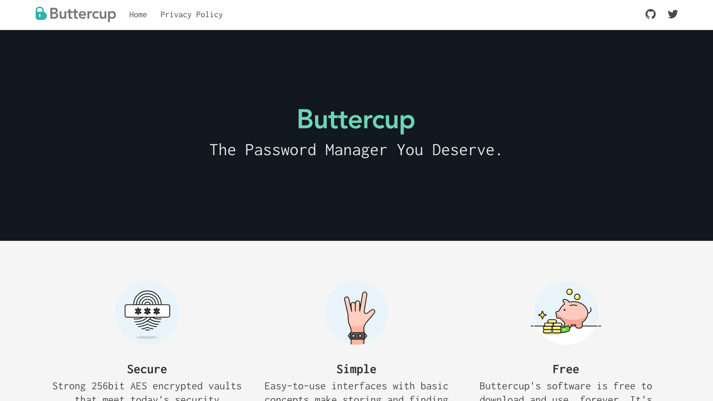

# Buttercup.pw

Buttercup is a free, open-source and cross-platform password manager. This repository contains Buttercup's static homepage.

### Usage
- `git clone https://github.com/buttercup/buttercup-website.git`
- `cd buttercup-website`
- `npm install`
- `npm dev` to run locally at localhost:3000